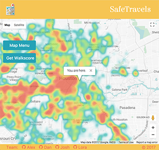

# SafeTravels

SafeTravels visualizes local bus and bikeways in Houston as well as local crime data to help you navigate through the city safely.



A live demo of the app can be found [here](https://safetravels.loragriffin.com).

From the Map Menu you can visualize Houston crime data as a heat map or as individual markers that, when clicked, provide detailed information for particular crimes. The Map Menu also allows you to visualize bus and bike route information in order determine the safest route.

Finally, from the Map, click the "Get WalkScore" button to see the walk, bike, and transit score for your location, in addition to nearby amenities, such as restaurants, entertainment, and groceries.

Currently, SafeTravels only supports data for Houston, Texas, but we are working to include more cities soon.

## Built With

* Flask
* Python
* JavaScript
* jQuery
* PostgreSQL
* PostGIS
* SQLAlchemy
* Axios
* Google Maps API
* WalkScore API

## Code Example
```js
function toggleHeatmap() {
  heatmap.setMap(heatmap.getMap() ? null : map);
}

function handleLocationError(browserHasGeolocation, infoWindow, pos) {
  infoWindow.setPosition(pos);
  infoWindow.setContent(browserHasGeolocation ?
    'Error: The Geolocation service failed.' :
    'Error: Your browser doesn\'t support geolocation.');
  infoWindow.open(map);
}

// loading data into map
function load_geojson(results, type) {
  FEATURE_TYPE = type;
  map.data.addGeoJson(results);
}

// Filters data for type: crime
function add_crimes () {
  axios.get(`/crimes?minx=${minx}&maxx=${maxx}&miny=${miny}&maxy=${maxy}`)
    .then(function (response) {
      load_geojson(response.data, 'crime');
   })
  .catch(function (error) {
     console.log(error);
   });
}
```

## Authors

 - [Lora Griffin](https://github.com/loragriffin)
 - [Dan Haggerty](https://github.com/danhagg)
 - [Alex Sulsky](https://github.com/xanlex)
 - [Josh Westbury](https://github.com/joshwestbury)

## License

This project is licensed under the MIT License - see the [LICENSE.md](LICENSE.md) file for details

## Future Enhancements

* Make the site mobile responsive
* Include data for additional cities
* Include additional data, such as bus stops, walking and hiking paths, etc.
* Allow users to input a different location
* Allow users to map from point A to point B
